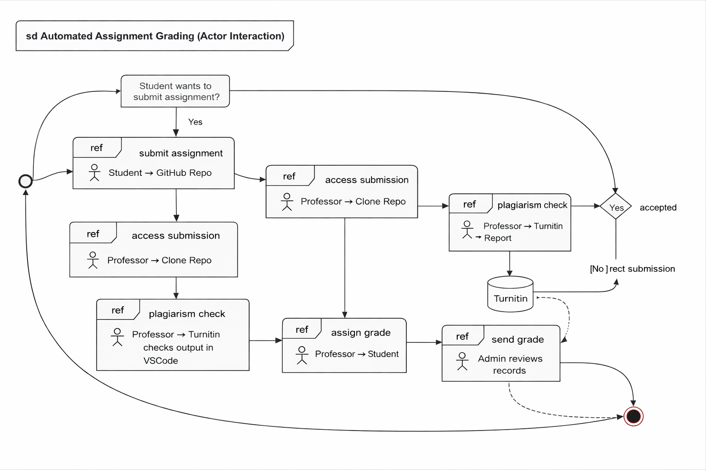

## 1. Aim

To model and analyze the interactions between actors involved in an automated assignment grading system by developing an Interaction Overview Diagram (IoD) and a Use Case Diagram (UCD), in order to understand how assignment submission, plagiarism detection, grading, and auditing processes can be efficiently automated.

## 2.  Introduction/Background information
This practical focuses on designing and modeling a system for automating the grading of programming assignments in a university environment. Currently, the process is manual, where students submit their work via GitHub repositories and professors clone, execute, and evaluate the code individually. This approach is time-consuming, inefficient, and lacks scalability for large numbers of students.
To address these challenges, an Automated Assignment Grading System is proposed. The system aims to streamline submission, execution, grading, and plagiarism detection processes. It integrates with external tools such as GitHub for code hosting and Turnitin for plagiarism detection, as well as the university’s Learning Management System (LMS) for grade synchronization.
The modeling of this system is carried out using Unified Modeling Language (UML) diagrams. Specifically:
Interaction Overview Diagrams (IoD) are used to represent workflows and interactions between actors.
Use Case Diagrams (UCD) are used to define the functional requirements of the system and how different users interact with it.
These modeling techniques help in visualizing system behavior, improving design clarity, and ensuring that all functional and non-functional requirements—such as persistence, auditability, and deadline enforcement—are properly addressed. The design process uses UML as the primary modeling technique to analyze system interactions and functionalities before implementation.

## 3.  Tasks

1

2
.png>)

3

## 4. Conclusion
In this practical, the design of an Automated Assignment Grading System was analyzed using UML diagrams, specifically the Interaction Overview Diagram (IoD) and Use Case Diagram (UCD). The IoD helped in understanding the flow of interactions between actors such as students, professors, administrators, and external services, both in a manual and system-supported environment. The UCD clearly defined the functional requirements of the system, including assignment submission, automated code execution, plagiarism detection, grading, and auditing.
Through this modeling process, it was observed that automation significantly improves efficiency, reduces manual workload, and ensures consistency in grading. Additionally, features such as multiple submissions, deadline enforcement, and integration with external systems like LMS and plagiarism detection services enhance the reliability and scalability of the system.
Overall, the use of UML diagrams provided a structured approach to visualize and design the system, ensuring that all user requirements are met while maintaining auditability and performance for a large number of users.

## 5. Reference

Object Management Group (OMG), Unified Modeling Language (UML) Specification, Version 2.5.1.

Software Engineering, 10th Edition, Pearson Education.

Software Engineering: A Practitioner’s Approach, McGraw-Hill Education.

Turnitin Official Website: https://www.turnitin.com

GitHub Documentation: https://docs.github.com

Unified Modeling Language Tutorials and documentation from https://www.uml.org

Lucidchart / draw.io (for creating UML diagrams)

## Promt used in ChatGPT

https://chatgpt.com/share/69cab79b-d948-8321-9e2c-3c8e31bf1bb0